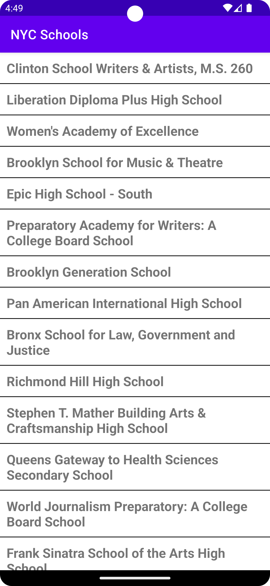
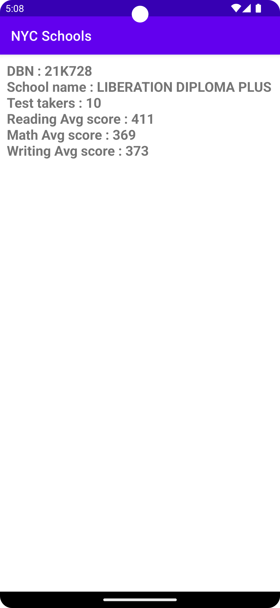

# NYC Schools

A sample app that lists schools in NYC area and display SAT stats for them

This sample showcases:
* Networking : Okhttp and Retrofit
* DI : Hilt
* UI : Android Views and MVVM
* Testing : Added Tests for ViewModel

  
